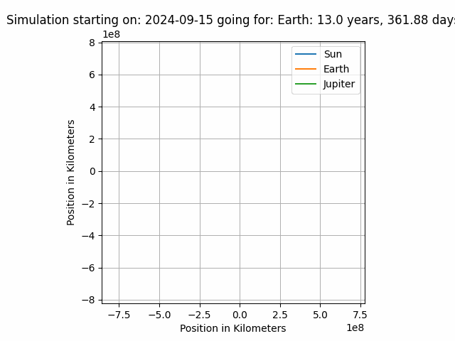

# Orbital Mechanics Simulations
## Project Purpose
### I want to better understand n-body dynamics for n > 2
Specifically I am interested in learning more about Lagrange points, and how satellites will behave in the different types of lagrange points.
I also want to see what types of maneuevers are required to enter and stay within a lagrange point. (How are there asteroids in Earth-Sun L4 and L5?)
### I want to learn and subsequently improve my ability to interface C++ with Python
The simulation code is written in C++, and the main interface is written in python.
Before now I hadn't done anything like this.
ChatGPT is an instrumental learning tool when it comes to completely new territory like this; I.e. writing a python library in C++, and figuring out how to do that in a timely manner as part of a side project for a class.
The n-body ODE python code is mine, a lot of the other stuff is scavenged. 
(The runge-kutta python was provided by my professor, and it came from a textbook)

### I want to see what sort of information I can glean
Specifically I want to try to simulate a grid of different starting positions within lagrange points, and see where the most stable position is

## Some fun graphs

## Features to add

### - mass data from JPL Horizons 
Pull from JPL Horizons rather than using hardcoded values

### - Graph Focus function
which sets the center and optionally a target object for graphing translated and rotational reference frames

#### -- A function to add satellites
I would like to be able to add small satellites given orbital ephemerides with reference to the target body

#### -- Preventing satellites from affecting large planetary bodies
If I wanted to add 50 satellites with slightly different orbital parameters, this would add unnecessary computation steps to the simulation due to their inconsequential mass. Therefore I want to add a feature which removes their force effects on other bodies

### - Error Correction From JPL Horizon data
It would be nice to correct the simulation for named bodies at key times based off of JPL Horizons data

#### -- Error analysis compared to JPL Horizons baseline
It would be nice to estimate the error over time of this simulator using JPL Horizons as a baseline

### - some sort of patched conics implementation
Given a focus it would be cool to try out some patched conics

### - 3d or other ways of displaying calculated simulation data

## Runge Kutte Solvers

I grabbed these from wikipedia in order to implement my RKF4(5) solver

